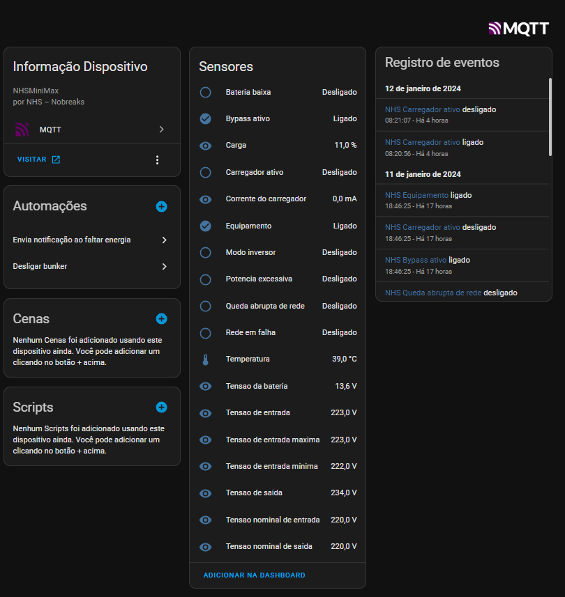

# NHS Nobreak Monitor

Este docker é projetado para monitorar um nobreak da marca NHS e enviar informações para o Home Assistant via MQTT para que você consiga fazer automações com os dados do nobreak. EX. desligar servidor, enviar notificação avisando da queda de energia ou retorno de energia e etc.

https://hub.docker.com/r/ruizivo/nhs-nobreak-monitor

## Requisitos

- Nobreak NHS com UBS ligado ao linux*
- Docker
- Docker Compose
- Home Assistant instalado e configurado
- Broker MQTT instalado e configurado
- Integraçao do MQTT configurado no Home Assistant


*Devido a limitaçao do docker de fazer o mapeamento de dispositivos entre host e container. 
Só é possivel maperar entre maquinas linux -> linux ou Windows -> windows. 

Para fazer:
- [ ] Fazer docker windows (verificar a possibilidade)

## Configuração

1. Execute o Docker Compose:

    ```bash
    docker-compose up -d
    ```

    Isso iniciará o programa em um contêiner Docker. Você tambem pode acessar a propria aplicação da NHS para visualizar as configurações e estados do nobreak. 
    http://localhost:2001 ou http://endereco_container:2001

Se você configurou tudo corretamente ira aparecer no seu Home Assistant um dispositivo com alguns sensores.




Espero que essa aplicação sirva seu proposito para você assim como serviu para mim. E conceguir fazer suas automações com o esse projeto.

Sinta-se a vontade em tirar suas duvidas!